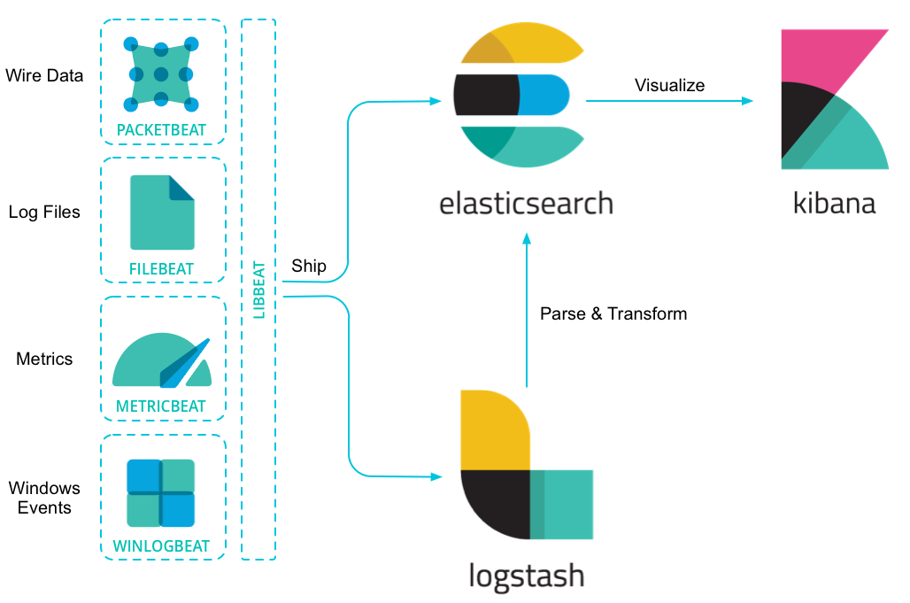
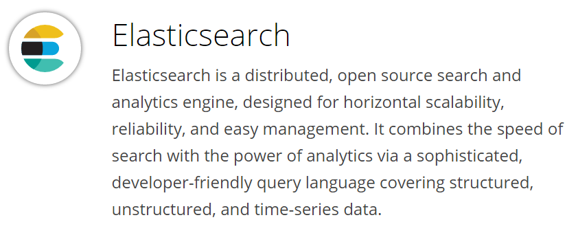
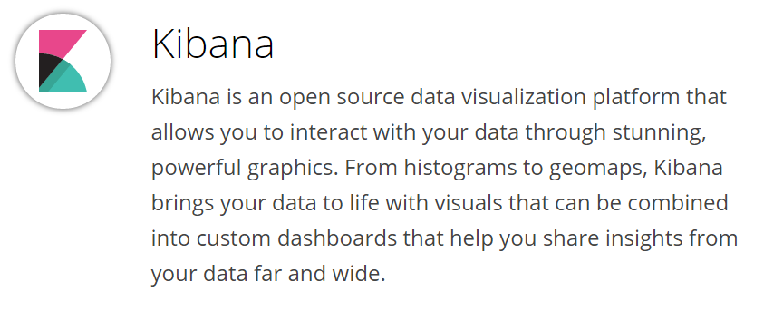
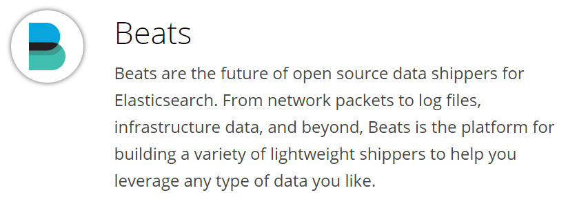

# ELK Stack

<small>Ref: https://www.elastic.co/guide/en/beats/libbeat/current/beats-reference.html</small>

## Elasticsearch, Logstash and Kibana

> Different open source modules working together

* Helps users/admins to collect, analyse and visualize data in (near) real-time
* Each module fits based on your use case and environment

## Components of the stack

* Elasticsearch
* Logstash
* Kibana
* Beats

### Elasticsearch

<small>Ref: https://www.elastic.co/products</small>

* Distributed and Highly available search engine, written in Java and uses Groovy (now started painless scripting)
* Built on top of Lucene
* Multi Tenant with Multi types and a set of APIs
* Document Oriented providing (near) real time search

### Logstash

<small>Ref: https://www.elastic.co/products</small>

* Tool for managing events and logs written in Ruby
* Centralized data processing of all types of logs
* Consists of 3 main components
    * Input : Passing logs to process them into machine understandable format
    * Filter : Set of conditions to perform specific action on a event
    * Output : Decision maker for processed events/logs

### Kibana

<small>Ref: https://www.elastic.co/products</small>

* Powerful front-end dashboard written in JavaScript
* Browser based analytics and search dashboard for Elasticsearch
* Flexible analytics & visualisation platform
* Provides data in the form of charts, graphs, counts, maps, etc. in real-time

### Beats

<small>Ref: https://www.elastic.co/products</small>

* Lightweight shippers for Elasticsearch & Logstash
* Capture all sorts of operational data like logs or network packet data
* It can send logs to either Elasticsearch, Logstash

## ELK Reference Guide

We can use the below Gitbook with detailed instructions for references to the ELK stack setup and usage.

* [https://appsecco.com/books/elk-workshop](https://appsecco.com/books/elk-workshop)