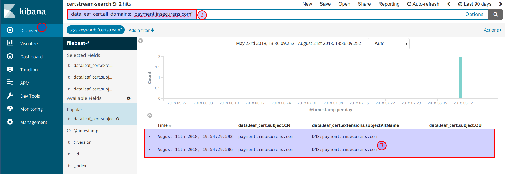

# Monitoring phishing domains

## Let's monitor subdomains at near real time using Certificate Transparency data

- We'll use ELK stack to visualise and monitor for phishing domains
- We have already parsed the certificate transperancy logs in scenario-1. We use the same logs to monitor for phishing domains

### How do we do this?

* We will be using the `certstream` log search query




### Alerting based on new domains created

* We can use opensource tools like elastalert to setup automated alerts based on new domains using the rules
* The below rule is the example rule to alert based on new domain SSL/TLS certificate creation. Here we will be using the domains we collected from the `dnstwist`

```yaml
es_host: localhost
es_port: 9200
name: "New certificate alert"
type: frequency
index: filebeat-*
num_events: 1
timeframe:
  minutes: 1

# For more info: http://www.elasticsearch.org/guide/en/elasticsearch/reference/current/query-dsl.html

filter:
- query:
    query_string:
      query: 'tags: "certstream" AND name: "*.insecurens.com" AND name: "*.insecurenss.com"'

alert:
  - slack

slack:
slack_webhook_url: "https://hooks.slack.com/services/xxxxx"
slack_username_override: "alert-bot"
slack_emoji_override: "robot_face"

realert:
  minutes: 0
```